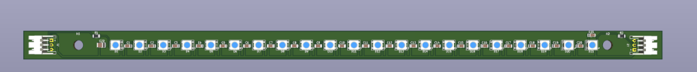
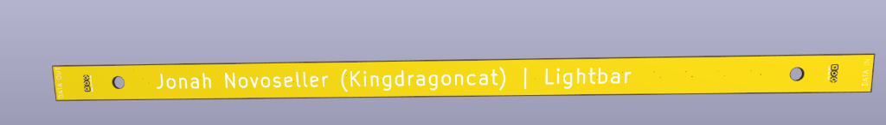
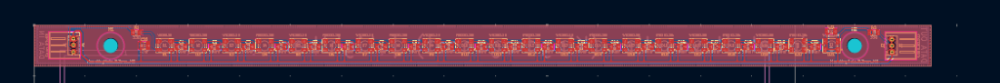
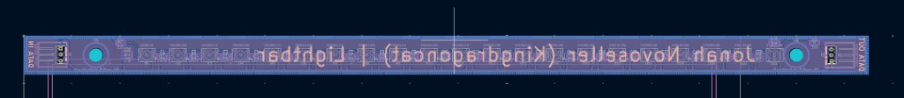
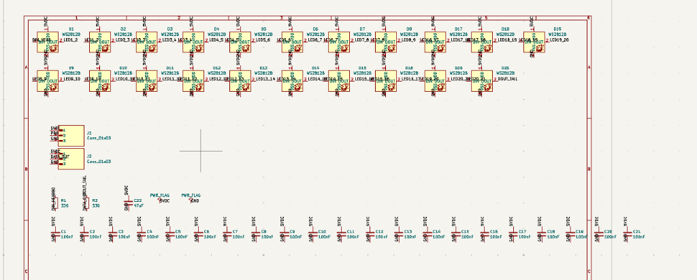

# LightBar

simple extendable light bar meant to be mounted to whatever project you want. just chain em together and go

## what is this

its a PCB with 20 WS2812B addressable LEDs on it. theres connectors on both ends so you can daisy chain multiple bars together. each LED has its own 100nF bypass cap. theres also mounting holes on each end so you can screw it down to stuff

## pcb layout

## schematic

## specs

- 20x WS2812B addressable RGB LEDs
- 5V power
- data in/out connectors on both ends for daisy chaining
- 100nF decoupling cap per LED
- mounting holes on both ends
- designed in KiCad

## wiring

hook up 5V, GND, and data to the input connector and youre good. if you want more bars just connect the output of one to the input of the next

## license

do whatever you want with it honestly

---

made by Jonah Novoseller (Kingdragoncat)
